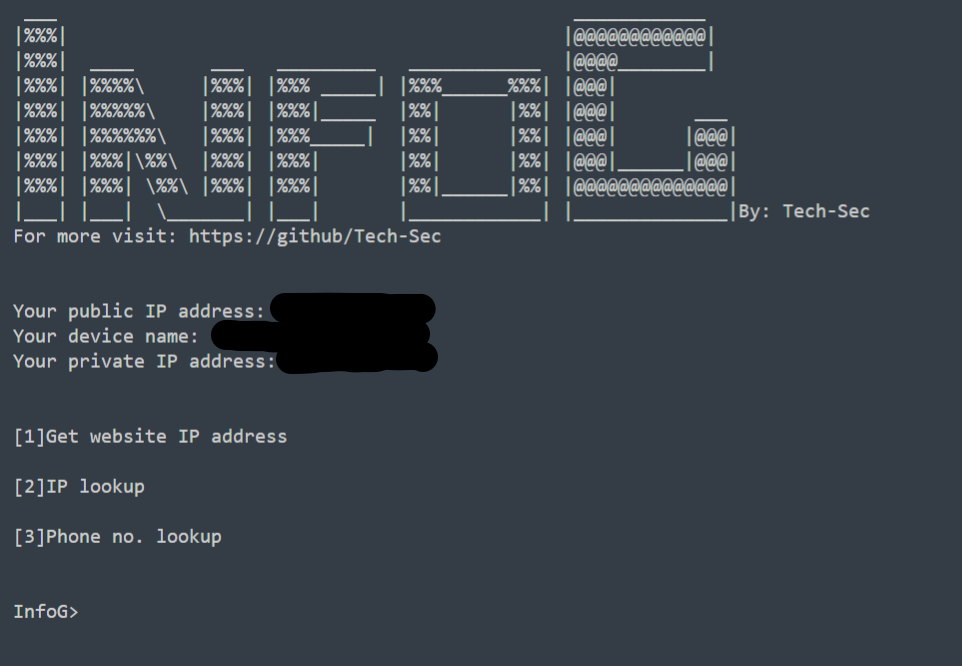

# InfoG
InfoG (it's Info-jee) is an information gathering tool. You can find ip addresses, phone number details and much more.

**How to use:**

First clone the repository:\
**git clone https://github.com/Tech-Sec/InfoG.git**

Change your directory to InfoG  folder:\
**cd InfoG**

Then type:\
**pip install -r requirements.txt**

In the terminal, type:\
**python InfoG.py**\

and get started!!!
